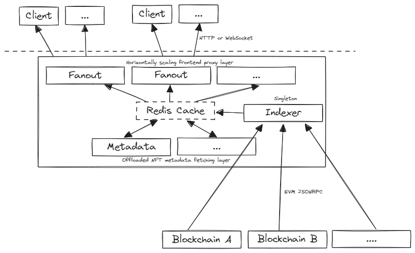

# Custom Multichain Indexer
This custom indexer is a foundational implementation designed for indexing blockchain events across multiple networks and it collects and stores NFT metadata.

## Supported On-Chain Standards
* ERC-721 tokens
* Warm.xyz (including transfers)
* Delegate.xyz v1 and V2 (including wallet, contract, and specific token delegations)
* NFT Metadata Extension (new protocol)
* Bulk NFT token URI fetching (new protocol)

## External Requirements
The indexer requires the following external services to be configured and running to function correctly.
* Redis -  should have enough storage for all metadata - O(gigabytes). Tested with **redis.io** managed redis.
* An Ethereum JSON RPC endpoint - **Infura** is recommended based on testing - it outperformed Alchemy on reliability
* HTTP Proxy for metadata fetching - **Apify** is recommended to prevent rate limiting

## Delegation Semantics
Warm.xyz and Delegate.xyz weren't designed with metaverse use cases in mind, so we have to make some assumptions about how they should be used in the context of a virtual world.

* Any token is valid in only one wallet at a time - either the owner wallet, or a delegated wallet
* In the case of multiple candidates for a delegated wallet, the most recent valid delegation is the one that is respected
* No cascading delegations - if a wallet is delegated to another wallet, the delegated wallet cannot delegate the same token to another wallet
* Delegation protocols are bound to the blockchain they are deployed - delegating on Ethererum does not delegate Polygon tokens
* Expiring Warm.xyz delegations are not supported yet

Some assumptions are made around NFT metadata
* Metadata URIs cannot change after minting
* Dynamic NFT metadata - the metadata is only fetched once and cached

## Architecture

The indexer consists of a single repo and entry point that can assume three roles - the `indexer` / `fanout` /`metadata`. 

For any indexer instance, there is assumed to be 
* a single instance of the `indexer` role
* zero to many instances of the `fanout` role
* one to many instances of the `metadata` role

The **indexer** in parallel reads from multiple blockchains, materializing a local view of the blockchains and ownership and delegation state. Periodically, this state is flushed into Redis, and affected parts of the index are published on redis pubsub.

The **fanout** nodes either handle on-off requests for specific index content, fetched straight from redis, or connections can subscribe to specific wallets or all via websockets. The fanout nodes are stateless and can be scaled horizontally.

The **metadata** nodes are responsible for fetching and caching metadata URIs for NFTs. They are stateless and can be scaled horizontally.

The overall architecture is intended to have purely transient state - it can be torn down and redeployed at will - the indexer will take a few minutes to catch up to the latest state, but the fanout nodes will be able to serve requests immediately.

Due to the multi-level fanout architecture (redis --> fanout nodes --> clients), and the low write throughput from a steady-state indexer instance (only writes on new blocks), the system is expected to be able to handle a large number of clients and requests in realtime.

## Non-destructive rollouts
The latest blocks that have been pushed to Redis for every blockchain are stored in a key. When the indexer restarts it will not push its in-memory state into Redis until it has caught up to the latest blocks. This allows for non-destructive rollouts and upgrades. There is a configurable prefix for the Redis keys in the case of backwards-compatibility breaking changes. 

The indexer currently will restart from the configured starting blocks per chain, but in the future, it should be able to restart from the last known block in redis to reduce the time to catch up.

